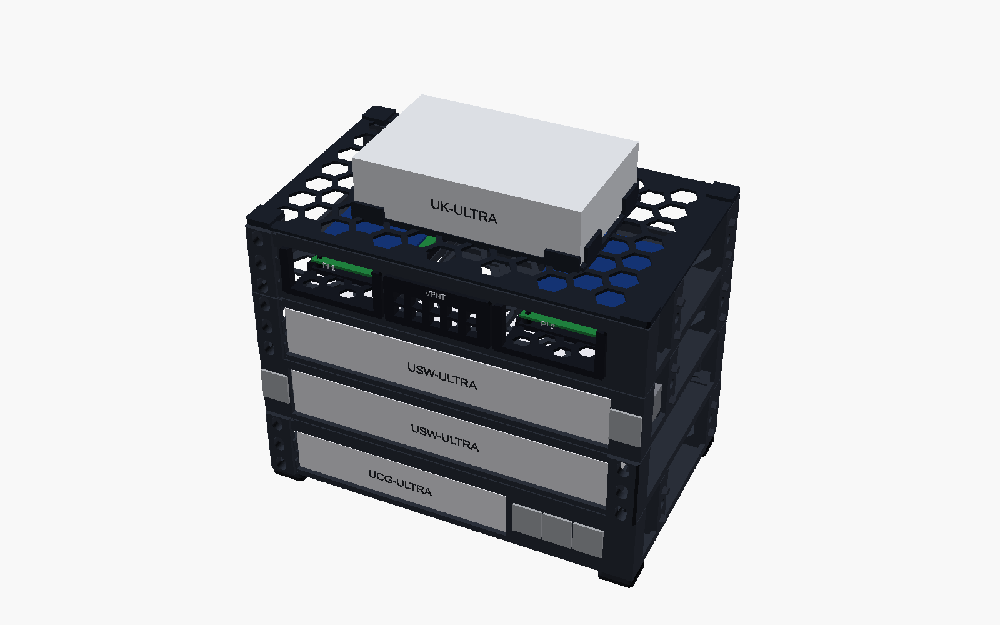

# Modular printable homelab rack

A parameterized, support-free OpenSCAD rack for a desktop stack today and
paired half-width modules in a standard 19-inch rack later. The current build
holds a UCG-Ultra, two USW-Ultra units, two Raspberry Pi 5 drawers, a removable
vent insert, and a UK-Ultra top carrier.

[**Start with `PRINT_THESE`**](PRINT_THESE/) ·
[3D viewer](https://daniel-hauser.github.io/homelab-rack/) ·
[rack render](renders/rack_preview_final.png) ·
[all build plates](renders/beds/all_beds.png)



## Print first

Use the numbered files exactly as tracked. Do not use old aliases from previous
design revisions.

1. Open
   [`PRINT_THESE\TEST_FIRST\plate_1-test.3mf`](PRINT_THESE/TEST_FIRST/plate_1-test.3mf)
   in **Bambu Studio 02.08.02.61**, or import these ten STLs individually:

   - `PRINT_THESE\TEST_FIRST\01_Bay_Fit_Test.stl`
   - `PRINT_THESE\TEST_FIRST\02_Rear_Spine_A.stl`
   - `PRINT_THESE\TEST_FIRST\03_Rear_Spine_B.stl`
   - `PRINT_THESE\TEST_FIRST\04_Desktop_Feet_Set.stl`
   - `PRINT_THESE\TEST_FIRST\05_Magnet_Keystone_Peg_Test.stl`
   - `PRINT_THESE\TEST_FIRST\06_Vent_Insert.stl`
   - `PRINT_THESE\TEST_FIRST\07_Magnet_Polarity_Key.stl`
   - `PRINT_THESE\TEST_FIRST\08_Rack_Ear_Test.stl`
   - `PRINT_THESE\TEST_FIRST\09_Seam_Tower_Male_Test.stl`
   - `PRINT_THESE\TEST_FIRST\10_Seam_Tower_Female_Test.stl`

2. Confirm the magnet pockets, stack peg/socket, keystone opening, Pi bay,
   seam towers, rack-ear slots, and snap post fit your hardware.
3. If the test plate succeeds, open
   [`PRINT_THESE\homelab-rack-Bambu-Studio-6-plates.3mf`](PRINT_THESE/homelab-rack-Bambu-Studio-6-plates.3mf)
   or double-click `PRINT_THESE\OPEN_IN_BAMBU_STUDIO.cmd`.
4. Keep the rear spines flat on their broad faces. All tracked STLs are already
   exported in their intended print orientation.

The six-plate project uses a Bambu Lab A1 with a 0.4 mm nozzle, 0.20 mm layers,
four walls, five top layers, four bottom layers, 20% gyroid, no supports, no
brim, and no skirt. The validated estimate is **529.43 g**, **177.51173 m**,
**426.96577 cm³**, and **23h04m49s** serial printing time.

Bambu Studio reports a conservative “floating cantilever” warning on the four
full-height chassis. Their maximum measured bridge is 13.79 mm. Print plate 1
first; if both seam-tower coupons are clean, keep automatic supports disabled
for the production chassis because generated supports obstruct functional
pockets and fill large open areas.

## Production STLs

`PRINT_THESE\STLs` contains only the ten required production files:

| File | Part |
| --- | --- |
| `01_UCG_Ultra.stl` | UCG-Ultra module |
| `02_USW_Ultra_Left.stl` | left USW-Ultra module |
| `03_USW_Ultra_Right.stl` | right USW-Ultra module |
| `04_Dual_Pi_Chassis.stl` | three-bay dual-Pi chassis |
| `05_Pi_Drawer_1.stl` | first Pi 5 drawer |
| `06_Pi_Drawer_2.stl` | second Pi 5 drawer |
| `07_Vent_Insert.stl` | center bay vent |
| `08_UK_Ultra_Top.stl` | desktop UK-Ultra carrier |
| `09_Rear_Spine_A.stl` | first rear spine |
| `10_Rear_Spine_B.stl` | second rear spine |

The two rear-spine files are intentionally identical; print both. The removable
feet are on the test-first plate.

## Design summary

- Half-module structural footprint: 241.30 × 150.00 mm.
- Paired width: 482.60 mm, with 465.10 mm rack mounting centers.
- Rack pitch: 44.45 mm; vertical hole centers: 6.350, 22.225, 38.100 mm.
- Universal magnets: 6 × 2 mm discs.
- Vertical registration: printed pegs plus magnets.
- Side joining: tapered diamond keys in reinforced seam towers.
- Desktop stabilization: two removable rear spines and four removable feet.
- Pi mounting: split printed snap posts for official 2.7 mm mounting holes.
- Exposed chassis/top corners: 1.5 mm support-free chamfers.
- Pi and vent faceplates: 1.2 mm chamfers.

Magnets retain joints but are not structural. Printed pegs and keys carry
lateral loads. A 19-inch installation still requires normal rack screws and
cage nuts. The UK-Ultra carrier assumes the OEM keyed backplate/cradle remains
attached.

Run the analytical checks before changing structural parameters:

```powershell
python .\rack_check.py
python .\load_check.py
python .\release_check.py
```

The current conservative screening reports a 2.6× honeycomb yield safety
factor, 93× stack-peg shear safety, 158.5× side-key shear safety, 7.9×
side-key interlayer bending safety, and 3.7× seam-tower interlayer safety.
These calculations do not replace a physical proof load.

## Reproduce or verify the release

The canonical geometry source is [`homelab_rack.scad`](homelab_rack.scad).
The release is pinned to:

- **OpenSCAD 2021.01** for STL and canonical CAD render generation.
- **Bambu Studio 02.08.02.61** for arrangement, slicing, estimates, and 3MF
  output.
- Python 3.13 with the pinned packages in `requirements.txt`.
- Node.js 22 with dependencies locked by `viewer\package-lock.json`.

Install Python dependencies:

```powershell
python -m pip install -r .\requirements.txt
```

Use one workflow for all OpenSCAD-derived release assets:

```powershell
# Export to ignored out\release-work and hash-check all tracked release assets.
.\export.ps1 -Mode Verify

# Deliberately replace the 20 numbered STLs, 11 viewer meshes,
# four canonical renders, and viewer estimate copy.
.\export.ps1 -Mode Generate
```

`Verify` compares fresh OpenSCAD exports with:

- all ten `PRINT_THESE\STLs` files using order-independent mesh hashes;
- all ten `PRINT_THESE\TEST_FIRST` files using order-independent mesh hashes;
- ten viewer production copies plus the viewer-only installed-feet model using
  the same geometry check;
- the four canonical CAD renders byte-for-byte; and
- `viewer\public\estimate.json` against `slicer\release\estimate.json`.

The mesh hash ignores harmless STL facet ordering differences between
OpenSCAD runs. The tracked binary artifacts and their published SHA-256 hashes
are not changed by `Verify`.

### Bambu Studio / 3MF boundary

The repository automates same-named mesh replacement while preserving an
existing Bambu arrangement, but it does **not** automate Bambu Studio itself.
After changing geometry, first run `export.ps1 -Mode Generate`, then create
unsliced arrangement copies:

```powershell
python .\slicer\replace_3mf_meshes.py `
  .\PRINT_THESE\homelab-rack-Bambu-Studio-6-plates.3mf `
  .\out\homelab-rack-arranged-unsliced.3mf `
  .\PRINT_THESE\STLs .\PRINT_THESE\TEST_FIRST

python .\slicer\replace_3mf_meshes.py `
  .\PRINT_THESE\TEST_FIRST\plate_1-test.3mf `
  .\out\plate_1-arranged-unsliced.3mf `
  .\PRINT_THESE\STLs .\PRINT_THESE\TEST_FIRST
```

Open those copies in **Bambu Studio 02.08.02.61**, confirm the pinned A1
profile, slice every plate, inspect warnings, and save the final projects over
the tracked release 3MF files only after validation. This slicer step is
required: the replacement tool intentionally removes stale embedded G-code.

Raw `.gcode` and `.gcode.3mf` work products are ignored and are **not** tracked
release inputs. When fresh Bambu outputs exist locally, bridge audits and bed
renders can be regenerated with:

```powershell
python .\slicer\bridge_audit.py `
  .\slicer\production\desktop-strong `
  --project .\PRINT_THESE\homelab-rack-Bambu-Studio-6-plates.3mf `
  --output .\bridge-audit.json

python .\slicer\render_beds.py `
  .\slicer\production\desktop-strong `
  .\slicer\production\desktop-strong\desktop-strong.gcode.3mf `
  .\renders\beds
```

## Viewer

The public viewer is deployed by GitHub Pages without repository secrets:
<https://daniel-hauser.github.io/homelab-rack/>.

Local build:

```powershell
Set-Location .\viewer
npm ci
npm run build
```

The viewer uses relative asset paths, so it works under the repository Pages
subpath. Its displayed release totals come from
`viewer\public\estimate.json`, synchronized from the slicer estimate by
`export.ps1`.

## Dimensions to verify physically

Manufacturer envelopes are sufficient for the adjustable cradles, but verify
these before a long print:

- UCG-Ultra and USW-Ultra corner radii;
- assembled Pi 5, cooler, HAT, and NVMe height;
- keystone latch depth and panel-thickness requirements; and
- cable boot bend radius behind each rear-facing port.

Sources: [UCG-Ultra](https://techspecs.ui.com/unifi/cloud-gateways/ucg-ultra),
[USW-Ultra](https://techspecs.ui.com/unifi/switching/usw-ultra),
[UK-Ultra](https://techspecs.ui.com/unifi/wifi/uk-ultra),
[Waveshare PoE M.2 HAT+ (B)](https://www.waveshare.com/poe-m.2-hat-plus-b.htm),
[Raspberry Pi 5 mechanical drawing](https://datasheets.raspberrypi.com/rpi5/raspberry-pi-5-mechanical-drawing.pdf),
and [Bambu Lab A1](https://bambulab.com/en/a1/tech-specs).

## License

See [`LICENSE.md`](LICENSE.md). Hardware sources and generated hardware
artifacts are CERN-OHL-S-2.0, software/tooling is MIT, and documentation and
rendered images are CC-BY-4.0.
