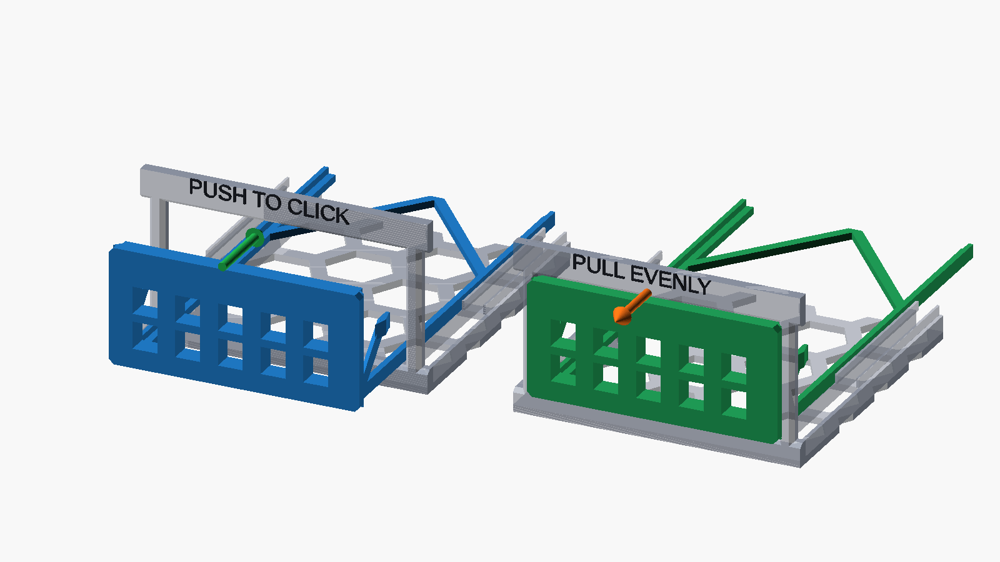

# Modular printable homelab rack

A parameterized, support-free OpenSCAD rack for a desktop stack today and
paired half-width modules in a standard 19-inch rack later. The current build
holds a UCG-Ultra, two USW-Ultra units, two Raspberry Pi 5 drawers, a removable
vent insert, and a UK-Ultra top carrier.

[**Start with `PRINT_THESE`**](PRINT_THESE/) ·
[3D viewer](https://daniel-hauser.github.io/homelab-rack/) ·
[rack render](renders/rack_preview_final.png) ·
[all build plates](renders/beds/all_beds.png)


## Choose the right project

### Already printed the older test-first plate

Open
[`PRINT_THESE\homelab-rack-Bambu-Studio-5-plates-NO-TEST.3mf`](PRINT_THESE/homelab-rack-Bambu-Studio-5-plates-NO-TEST.3mf)
or double-click `PRINT_THESE\OPEN_NO_TEST_PROJECT.cmd`. This is the optimized
production project: five A1 visits, no coupons, no polarity key, and every
final assembly object exactly once.

The project deliberately includes the current
`TEST_FIRST\04_Desktop_Feet_Set.stl`. The foot-to-stack peg and magnet geometry
changed, so feet from the older test plate are obsolete. No other test-only
artifact is required. The revised vent and both rear spines are already
included as final production objects.

| Plate | Objects |
| --- | --- |
| 1 | UCG-Ultra module; rear spine A |
| 2 | left USW-Ultra module; rear spine B |
| 3 | dual-Pi chassis; final rail-guided vent cartridge |
| 4 | right USW-Ultra module; Pi drawer 2 |
| 5 | UK-Ultra top; Pi drawer 1; revised desktop feet set |

The pinned native-Bambu estimate is **516.70 g**, **173.23944 m**,
**416.68971 cm³**, and **23h06m56s** serial printing time. Five plates are the
geometric lower bound: the four chassis and the UK-Ultra top each have an
axis-aligned footprint wider than 241 mm and deeper than 150 mm, so no two fit
on one 256 × 256 mm A1 plate without overlap. Smaller parts occupy otherwise
unused bed regions around those five unavoidable footprints.

### Have not printed a test plate

Use the numbered files exactly as tracked. Do not use old aliases from previous
design revisions.

1. Open
   [`PRINT_THESE\TEST_FIRST\plate_1-test.3mf`](PRINT_THESE/TEST_FIRST/plate_1-test.3mf)
   in **Bambu Studio 02.08.02.61**, or import these ten STLs individually:

   - `PRINT_THESE\TEST_FIRST\01_Bay_Fit_Test.stl`
   - `PRINT_THESE\TEST_FIRST\02_Rear_Spine_A.stl`
   - `PRINT_THESE\TEST_FIRST\03_Rear_Spine_B.stl`
   - `PRINT_THESE\TEST_FIRST\04_Desktop_Feet_Set.stl`
   - `PRINT_THESE\TEST_FIRST\05_Magnet_Keystone_Peg_Test.stl`
   - `PRINT_THESE\TEST_FIRST\06_Vent_Insert.stl`
   - `PRINT_THESE\TEST_FIRST\07_Magnet_Polarity_Key.stl`
   - `PRINT_THESE\TEST_FIRST\08_Rack_Ear_Test.stl`
   - `PRINT_THESE\TEST_FIRST\09_Seam_Tower_Male_Test.stl`
   - `PRINT_THESE\TEST_FIRST\10_Seam_Tower_Female_Test.stl`

2. Break off and mate the stack tiles, then confirm the magnet pockets,
   keystone opening, Pi bay, seam towers, and rack-ear slots fit your hardware.
3. If the test plate succeeds, open the original test-first project,
   [`PRINT_THESE\homelab-rack-Bambu-Studio-6-plates.3mf`](PRINT_THESE/homelab-rack-Bambu-Studio-6-plates.3mf)
   or double-click `PRINT_THESE\OPEN_IN_BAMBU_STUDIO.cmd`.
4. Keep the rear spines flat on their broad faces. All tracked STLs are already
   exported in their intended print orientation.

Both projects use a Bambu Lab A1 with a 0.4 mm nozzle, 0.20 mm layers,
four walls, five top layers, four bottom layers, 20% gyroid, no supports, no
brim, and no skirt. The original six-plate magnetic-direction estimate is
**547.11 g**, **183.43948 m**, **441.22368 cm³**, and **24h43m51s** serial
printing time. Loose-magnet attraction to all four assembled Pi/HAT screw
heads has passed physical testing.

Bambu Studio reports a conservative “floating cantilever/regions” warning on the four
full-height chassis. Their maximum measured bridge is 17.52 mm. Print plate 1
first; if both seam-tower coupons are clean, keep automatic supports disabled
for the production chassis because generated supports obstruct functional
pockets and fill large open areas.

The five-plate no-test project was sliced natively with the same pinned profile.
Its maximum classified bridge is 18.84 mm, all objects remain inside the A1
volume, and the only warnings are the same four explained chassis warnings.

## Production STLs

`PRINT_THESE\STLs` contains only the ten required production files:

| File | Part |
| --- | --- |
| `01_UCG_Ultra.stl` | UCG-Ultra module |
| `02_USW_Ultra_Left.stl` | left USW-Ultra module |
| `03_USW_Ultra_Right.stl` | right USW-Ultra module |
| `04_Dual_Pi_Chassis.stl` | three-bay dual-Pi chassis |
| `05_Pi_Drawer_1.stl` | first Pi 5 drawer |
| `06_Pi_Drawer_2.stl` | second Pi 5 drawer |
| `07_Vent_Insert.stl` | center bay vent |
| `08_UK_Ultra_Top.stl` | desktop UK-Ultra carrier |
| `09_Rear_Spine_A.stl` | first rear spine |
| `10_Rear_Spine_B.stl` | second rear spine |

The two rear-spine files are intentionally identical; print both. The removable
feet are on the test-first plate.

## Design summary

- Half-module structural footprint: 241.30 × 150.00 mm.
- Paired width: 482.60 mm, with 465.10 mm rack mounting centers.
- Rack pitch: 44.45 mm; vertical hole centers: 6.350, 22.225, 38.100 mm.
- Universal magnets: 6 × 2 mm discs.
- Vertical registration: four printed peg/socket pairs plus four magnet pairs
  at every module-to-module or module-to-cap interface.
- Side joining: tapered diamond keys in reinforced seam towers.
- Paired seam: 0.0 mm designed face gap with 1.5 mm socket-depth reserve.
- Desktop stabilization: two removable rear spines and four removable feet.
- Pi mounting direction: four 6 × 2 mm magnets beneath the existing exposed
  lower screw heads, with printed side/corner locators carrying shear.
- Exposed chassis/top corners: 1.5 mm support-free chamfers.
- Pi and vent faceplates: 1.2 mm chamfers.
- Pi bay receiving lead-in: 1.2 mm deep at 45°, opening to 64.4 × 32.4 mm at
  the front while retaining the 62 × 30 mm friction opening behind it.
- Vent cartridge: 111 mm L-section side runners with 77 mm of guide-lip
  engagement and a light rear chevron that prevents racking.

Loose 6 × 2 mm magnets physically attract all four intended lower screw heads,
so screw ferromagnetism is accepted. The current CAD assumptions remain a
1.60 mm screw-head protrusion, 0.35 mm working gap, and 0.30 mm printed
insulating skin. Validate the actual installed gap and retention on the first
production drawer before printing the second. The through-floor concept
remains review-only because it requires replacement screws. Review CAD and the
full measurement list are in
[`REVIEW_ONLY\Pi_Mount_Alternatives`](REVIEW_ONLY/Pi_Mount_Alternatives).

Do not print another test coupon for the Pi mount. Print only
`PRINT_THESE\STLs\05_Pi_Drawer_1.stl` first with the pinned production profile,
install four magnets, seat the actual Pi/HAT assembly, and verify vertical
retention, locator engagement, drawer insertion, and the installed holder gap.
Print Drawer 2 only after that first article passes.

The vent is a proper track-guided cartridge rather than a shallow friction
plate. Its proven 64.5 × 30 mm face is unchanged. Two long L-section runners
engage the same floor tracks and guide lips as the Pi drawers, with 0.15 mm
side clearance and 2.0 mm reserve before the chassis rear stop. Two
inward-rising rear chevron legs prevent racking while leaving the airflow path
open. The cartridge prints face-down; each chevron leg grows from a supported
runner and keeps the maximum slicer-classified bridge below 20 mm.

The vent and both Pi cartridges share paired cam-release spring detents. The
detent pockets have 0.20 mm more depth than the 0.45 mm engagement, so they
provide pull-out retention without defining lateral alignment or
overconstraining the guide tracks. Push straight in until both sides click and
the receiving chamfer seats the faceplate flush. Remove by gripping the
projecting faceplate edges and pulling evenly; the rear ramps flex both
detents inward without tools.



Rack-stack magnets retain joints while printed pegs and keys carry lateral
loads. The Pi magnets provide vertical retention only; their printed locators
carry shear. A 19-inch installation still requires normal rack screws and cage
nuts. The UK-Ultra carrier assumes the OEM keyed backplate/cradle remains
attached.

Each vertical module interface has magnet centers at `(8,20)`, `(233.3,20)`,
`(8,142)`, and `(233.3,142)` mm, with independent peg/socket centers at
`(13,25)`, `(228.3,25)`, `(13,137)`, and `(228.3,137)` mm. The front pairs sit
behind the rack-slot cut depth; the closest magnet pocket retains 0.675 mm of
clearance and the closest socket retains 6.15 mm. The pattern is identical on
all full modules and the cap, so handed rack ears cannot create
magnet-to-empty-pocket pairs.

The desktop stack has 20 vertical magnet pairs: four at each of the four
module/cap joints plus four foot-to-bottom-module pairs. Two rear spines add
eight horizontal pairs, two per module. They align and brace the rear of the
four-module stack against racking but do not replace vertical corner
clamping. With eight Pi-retention magnets, the fully populated desktop build
uses 64 magnets.

Use one marked pole consistently by global axis:

- Stack and foot magnets: marked face points globally up (`+Z`).
- Module/spine rear magnets: marked face points toward the rack rear (`+Y`).
- Future side-seam magnets: marked face points toward rack right (`+X`).
- Pi magnets attract steel screw heads, so polarity is not functional; use the
  marked face upward for installation consistency.

Run the analytical checks before changing structural parameters:

```powershell
python .\rack_check.py
python .\load_check.py
python .\release_check.py
```

The current conservative screening reports a 2.6× honeycomb yield safety
factor, 93× stack-peg shear safety, 158.5× side-key shear safety, 7.9×
side-key interlayer bending safety, and 3.7× seam-tower interlayer safety.
These calculations do not replace a physical proof load.

## Reproduce or verify the release

The canonical geometry source is [`homelab_rack.scad`](homelab_rack.scad).
The release is pinned to:

- **OpenSCAD 2021.01** for STL and canonical CAD render generation.
- **Bambu Studio 02.08.02.61** for arrangement, slicing, estimates, and 3MF
  output.
- Python 3.13 with the pinned packages in `requirements.txt`.
- Node.js 22 with dependencies locked by `viewer\package-lock.json`.

Install Python dependencies:

```powershell
python -m pip install -r .\requirements.txt
```

Use one workflow for all OpenSCAD-derived release assets:

```powershell
# Export to ignored out\release-work and hash-check all tracked release assets.
.\export.ps1 -Mode Verify

# Deliberately replace the 20 numbered STLs, 11 viewer meshes,
# five canonical renders, and viewer estimate copy.
.\export.ps1 -Mode Generate
```

`Verify` compares fresh OpenSCAD exports with:

- all ten `PRINT_THESE\STLs` files using order-independent mesh hashes;
- all ten `PRINT_THESE\TEST_FIRST` files using order-independent mesh hashes;
- ten viewer production copies plus the viewer-only installed-feet model using
  the same geometry check;
- the five canonical CAD renders pixel-for-pixel, ignoring harmless PNG
  compression differences; and
- `viewer\public\estimate.json` against `slicer\release\estimate.json`.

The mesh hash ignores harmless STL facet ordering differences between
OpenSCAD runs. The tracked binary artifacts and their published SHA-256 hashes
are not changed by `Verify`.

### Bambu Studio / 3MF boundary

The repository automates same-named mesh replacement while preserving an
existing Bambu arrangement, but it does **not** automate Bambu Studio itself.
After changing geometry, first run `export.ps1 -Mode Generate`, then create
unsliced arrangement copies:

```powershell
python .\slicer\replace_3mf_meshes.py `
  .\PRINT_THESE\homelab-rack-Bambu-Studio-6-plates.3mf `
  .\out\homelab-rack-arranged-unsliced.3mf `
  .\PRINT_THESE\STLs .\PRINT_THESE\TEST_FIRST

python .\slicer\replace_3mf_meshes.py `
  .\PRINT_THESE\TEST_FIRST\plate_1-test.3mf `
  .\out\plate_1-arranged-unsliced.3mf `
  .\PRINT_THESE\STLs .\PRINT_THESE\TEST_FIRST
```

When only a subset changed, pass `--skip-missing` with a directory containing
only those STLs. This preserves the validated triangulation and arrangement of
every unaffected project mesh while still removing stale embedded G-code.

Open those copies in **Bambu Studio 02.08.02.61**, confirm the pinned A1
profile, slice every plate, inspect warnings, and save the final projects over
the tracked release 3MF files only after validation. This slicer step is
required: the replacement tool intentionally removes stale embedded G-code.

Raw `.gcode` and `.gcode.3mf` work products are ignored and are **not** tracked
release inputs. When fresh Bambu outputs exist locally, bridge audits and bed
renders can be regenerated with:

```powershell
python .\slicer\bridge_audit.py `
  .\slicer\production\desktop-strong `
  --project .\PRINT_THESE\homelab-rack-Bambu-Studio-6-plates.3mf `
  --output .\bridge-audit.json

python .\slicer\render_beds.py `
  .\slicer\production\desktop-strong `
  .\slicer\production\desktop-strong\desktop-strong.gcode.3mf `
  .\renders\beds
```

The separated five-plate evidence is tracked in:

- `slicer\release\no-test-estimate.json`
- `slicer\release\no-test-bridge-audit.json`
- `renders\beds-no-test`

## Viewer

The public viewer is deployed by GitHub Pages without repository secrets:
<https://daniel-hauser.github.io/homelab-rack/>.

Local build:

```powershell
Set-Location .\viewer
npm ci
npm run build
```

The viewer uses relative asset paths, so it works under the repository Pages
subpath. Its displayed release totals come from
`viewer\public\estimate.json`, synchronized from the slicer estimate by
`export.ps1`.

## Dimensions to verify physically

Manufacturer envelopes are sufficient for the adjustable cradles, but verify
these before a long print:

- UCG-Ultra and USW-Ultra corner radii;
- assembled Pi 5, cooler, HAT, and NVMe height;
- keystone latch depth and panel-thickness requirements; and
- cable boot bend radius behind each rear-facing port.

Sources: [UCG-Ultra](https://techspecs.ui.com/unifi/cloud-gateways/ucg-ultra),
[USW-Ultra](https://techspecs.ui.com/unifi/switching/usw-ultra),
[UK-Ultra](https://techspecs.ui.com/unifi/wifi/uk-ultra),
[Waveshare PoE M.2 HAT+ (B)](https://www.waveshare.com/poe-m.2-hat-plus-b.htm),
[Raspberry Pi 5 mechanical drawing](https://datasheets.raspberrypi.com/rpi5/raspberry-pi-5-mechanical-drawing.pdf),
and [Bambu Lab A1](https://bambulab.com/en/a1/tech-specs).

## License

See [`LICENSE.md`](LICENSE.md). Hardware sources and generated hardware
artifacts are CERN-OHL-S-2.0, software/tooling is MIT, and documentation and
rendered images are CC-BY-4.0.
